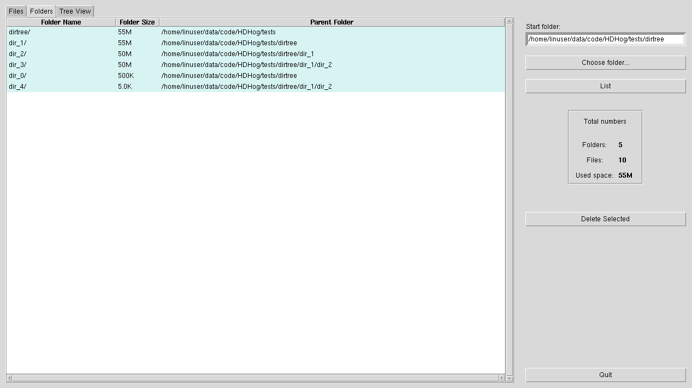
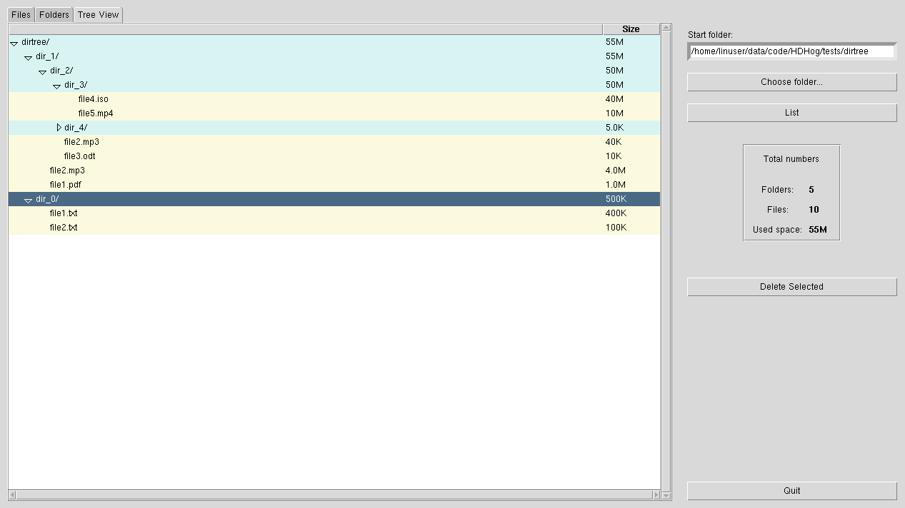

# HDHog

1. [About](#about)
1. [Features](#features)
3. [Usage](#usage)
4. [Screenshots](#screenshots)
5. [Notes](#notes)

Browse a folder, list files and subfolders **sorted by size accross the directory tree** so that you see the biggest first.

## About <a name="about"></a>
The motivation for this tool was to have something that conveniently lists big hard disk consumers in a folder and
can delete them. There is not really something free out there. Only the very old, unmaintained and exclusively Windows-based Disk Hog:\
https://www.softpedia.com/get/System/Hard-Disk-Utils/Disk-Hog.shtml\
And Disk Space Saver, which seems to do a great job but is partially paid software:\
https://qiplex.com/software/disk-space-saver/


This tool is written in Python and it's basically a wrapper around its ``os.walk()`` with ``os.path.getsize()`` on the files.


Only tested under Linux (Ubuntu) so far (since all file operations are written generically, theoretically it should work for all OSes that that Python supports and that have Tk, though).

## Features <a name="features"></a>
- Browse views
    - [x] File list
    - [x] Folder list
    - [x] View as tree

- Actions
    - [x] Delete selection

## Usage <a name="usage"></a>

Install dependencies:

```shell
pip3 install anytree sortedcontainers
```

Clone repository and run ``src/hdhog/hdhog.py``

## Screenshots <a name="screenshots"></a>

<table>
    <!-- <style>
        th{background-color:#e2fce6;}
        td{background-color:#fff9f3;}
    </style> -->
    <tr>
        <th style="background-color: #e2fce6" >View files</th> <!-- color Nyanza -->
        <td style="background-color: #fff9f3" align="center"></img></td> <!--  color Floral White -->
    </tr>
    <tr>
        <th style="background-color: #e2fce6" >View folders</th>
        <td style="background-color: #fff9f3" align="center"></img></td>
    </tr>
    <tr>
        <th style="background-color: #e2fce6" >View as tree</th>
        <td style="background-color: #fff9f3" align="center"></img></td>
    </tr>
 </table>

## Notes <a name="notes"></a>
- Symlinks are ignored and are not displayed for now